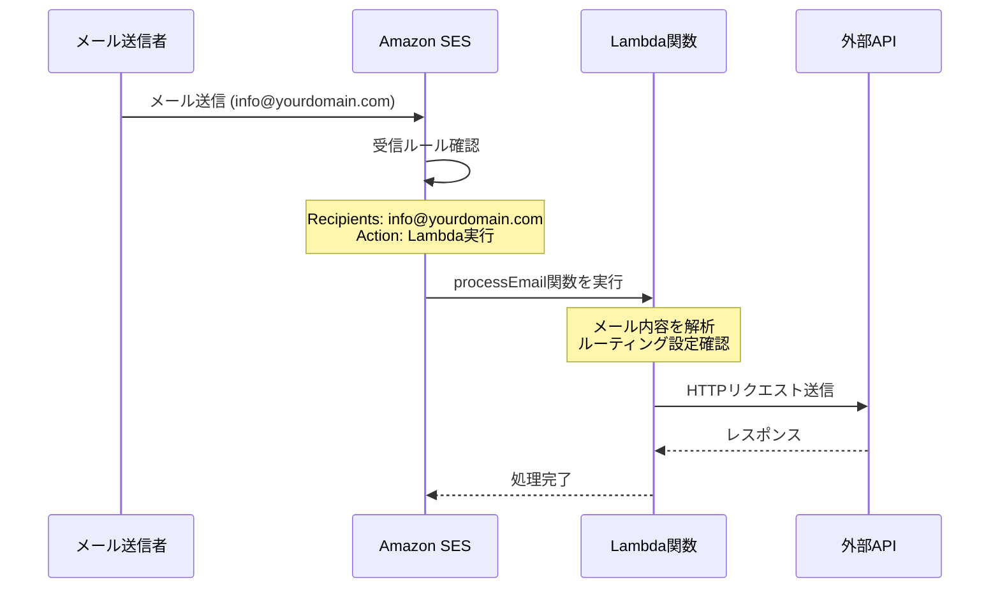

# Mail2Post アーキテクチャ概要

## システムアーキテクチャ図

```
+----------------+      +---------------+      +----------------+      +-----------------+
|                |      |               |      |                |      |                 |
|   メール送信者   +----->+   Amazon SES  +----->+  AWS Lambda    +----->+  外部Webサービス  |
|                |      |               |      |                |      |                 |
+----------------+      +---------------+      +----------------+      +-----------------+
                                |                     |
                                v                     v
                        +---------------+     +----------------+
                        |               |     |                |
                        |  Amazon S3    |     |  CloudWatch    |
                        | (オプション)    |     |    Logs        |
                        |               |     |                |
                        +---------------+     +----------------+
```

## 処理フロー

1. ユーザーが特定のメールアドレス（SESで設定）にメールを送信
2. Amazon SESがメールを受信
3. 受信ルールに基づき、メールデータがS3バケットに保存（オプション）またはLambda関数に直接渡される
4. Lambda関数がメールを処理
   - メールの内容を解析
   - 必要なデータを抽出
   - 指定されたフォーマットでPOSTデータを構成
5. Lambda関数が外部Webサービスに対してHTTP POSTリクエストを実行
6. 処理結果がCloudWatch Logsに記録される

## SES-Lambda連携の仕組み



**重要**: SESとLambdaの連携は、メールアドレスの指定だけでは自動的に連携されません。SES側で明示的に受信ルールを設定し、Lambda関数をアクションとして指定する必要があります。

## 拡張処理フロー

複数メールアドレスのルーティングを含む拡張処理フローは以下のようになります：

```
+----------------+      +---------------+      +----------------+      +-----------------+
|                |      |               |      |                |      |                 |
|  メール送信者   +----->+   Amazon SES  +----->+  ルーティング   +----->+  POST先 A       |
|                |      |  (複数アドレス) |      |  Lambda関数    |      |                 |
+----------------+      +---------------+      +-------+--------+      +-----------------+
                                |                      |
                                v                      |                +-----------------+
                        +---------------+              +--------------->+                 |
                        |               |              |                |  POST先 B       |
                        |  Amazon S3    |              |                |                 |
                        | (オプション)    |              |                +-----------------+
                        |               |              |
                        +---------------+              |                +-----------------+
                                                       +--------------->+                 |
                                                       |                |  POST先 C       |
                                                       |                |                 |
                                                       v                +-----------------+
                                                +----------------+
                                                |                |
                                                |  CloudWatch    |
                                                |    Logs        |
                                                |                |
                                                +----------------+
```

ルーティングの流れ：

1. SESで複数のメールアドレスを受信設定
2. 各メールアドレス宛てのメールをLambda関数で処理
3. メールの宛先アドレスに基づいて適切なPOST先を決定
4. 対応するPOST先に設定されたフォーマットでデータを送信
5. 処理結果をCloudWatch Logsに記録

複数エンドポイントとSlack連携を含む拡張処理フローは以下のようになります：

```
+----------------+      +---------------+      +----------------+      +-----------------+
|                |      |               |      |                |      |                 |
|   メール送信者   +----->+   Amazon SES  +----->+  AWS Lambda    +----->+  外部Webサービス |
|                |      |               |      |                +----->+  (プライマリ)     |
+----------------+      +---------------+      +-------+--------+      +-----------------+
                                |                      |
                                v                      |                +-----------------+
                        +---------------+              +--------------->+                 |
                        |               |              |                |  追加エンドポイント |
                        |  Amazon S3    |              |                |                 |
                        | (オプション)    |              |                +-----------------+
                        |               |              |
                        +---------------+              |                +-----------------+
                                                       +--------------->+                 |
                                                       |                |  Slack Channel  |
                                                       |                |                 |
                                                       v                +-----------------+
                                                +----------------+
                                                |                |
                                                |  CloudWatch    |
                                                |    Logs        |
                                                |                |
                                                +----------------+
```

Lambda関数は、設定に応じて以下の処理を並行して実行します：

1. プライマリエンドポイントへのPOSTリクエスト送信（常に実行）
2. 追加エンドポイントへのPOSTリクエスト送信（複数エンドポイント機能が有効な場合）
3. Slackチャンネルへの通知メッセージ送信（Slack連携機能が有効な場合）

各処理は独立して実行され、いずれかの処理が失敗しても他の処理には影響しません。全ての処理結果はCloudWatch
Logsに記録されます。

## Serverlessフレームワーク構成

Mail2Postプロジェクトは、Serverless
FrameworkやNode.js等のバージョンについては[common-config.md](./common-config.md)を参照し、以下のコンポーネントを定義・デプロイします：

- SES受信ルール設定
- Lambda関数
- 必要なIAMロールと権限
- S3バケット（オプション）
- CloudWatchアラーム

### IAMセキュリティ設計

Mail2Postシステムでは、セキュリティを確保するために以下のIAM戦略を採用します：

#### 1. 機能別のIAMロール

各Lambda関数には専用のIAMロールを割り当て、それぞれの機能に必要最小限の権限を付与します：

- **メール処理ロール**: SESからのメール受信、S3へのアクセス、外部APIへのPOST
- **監視ロール**: CloudWatchメトリクスの書き込み

#### 2. 権限の階層構造

```
Mail2Post IAM構造
├── 共通最小権限
│   └── CloudWatch Logs書き込み
├── メール処理関数の権限
│   ├── SESメール受信
│   ├── S3バケットへのアクセス
│   └── Secrets Managerからの読み取り
└── 環境別のリソースアクセス
    ├── 開発環境 (dev-*)
    ├── テスト環境 (staging-*)
    └── 本番環境 (prod-*)
```

#### 3. リソースポリシー

- SESサービスからのみLambda関数呼び出しを許可
- S3バケットは特定のLambda関数からのみアクセス可能
- Secrets Managerのシークレットは特定のLambda関数からのみ読み取り可能

## 環境分離

開発作業と本番環境の分離のため、以下の環境を構築します：

- 開発環境（dev）
- テスト環境（staging）
- 本番環境（prod）

Serverlessフレームワークのステージ機能を利用して、各環境を容易に切り替え可能にします。

### 環境別設定管理

各環境の設定は環境別JSONファイルで管理します：

- `config/dev.json` - 開発環境用設定
- `config/staging.json` - テスト環境用設定  
- `config/prod.json` - 本番環境用設定

これらのファイルには、AWS設定、SES設定、ルーティング設定、システム設定が含まれます。

## 環境別設定の仕組み

### 設定ファイルの動的読み込み

Mail2Postでは、単一の`serverless.config.cjs`ファイルが環境に応じて適切な設定を動的に読み込みます：

#### Stage判定の優先順位

1. **コマンドライン引数**: `--stage`パラメータから取得
2. **環境変数**: `SERVERLESS_STAGE`、`STAGE`、`NODE_ENV`から順次確認
3. **デフォルト値**: 上記すべてが未設定の場合は`'dev'`を使用

#### 設定読み込みプロセス

```javascript
// serverless.config.cjs内での処理例
const stage = getStage(); // 'dev', 'staging', 'prod'
const configPath = `./config/${stage}.json`;
const config = JSON.parse(fs.readFileSync(configPath, 'utf8'));
```

#### 自動生成される設定項目

- **SES受信者リスト**: `routes`設定のメールアドレスから自動生成
- **Lambda環境変数**: 設定ファイルの内容に基づいて自動設定
- **IAMロール**: 必要な権限を環境別に自動付与

### メリット

- **重複排除**: 環境ごとに設定ファイルを複製する必要がない
- **メンテナンス性**: 単一の設定ロジックで全環境対応
- **一貫性**: 設定形式が全環境で統一される
- **CI/CD対応**: 環境変数による自動切り替えが可能

## リポジトリアーキテクチャ

### ルートリポジトリの種類

システムではルーティング設定を管理するために、複数のリポジトリ実装を提供しています：

#### 1. FileRouteRepository（現在使用中）
- **用途**: 開発・テスト環境
- **設定**: JSONファイル（`config/dev.json`等）
- **特徴**: 
  - シンプルで軽量
  - デプロイ時に設定が固定される
  - 設定変更にはデプロイが必要

#### 2. S3RouteRepository（将来利用可能）
- **用途**: 本番環境での動的設定管理
- **設定**: S3バケット内のJSONファイル
- **特徴**:
  - 実行時の設定変更が可能
  - 複数のLambda間での設定共有
  - バージョン管理とバックアップ
  - スケーラブルな設定管理

#### リポジトリの切り替え方法

環境変数 `ROUTE_REPOSITORY_TYPE` で制御：

```bash
# ファイルベース（デフォルト）
ROUTE_REPOSITORY_TYPE=file

# S3ベース（将来対応）
ROUTE_REPOSITORY_TYPE=s3
```
